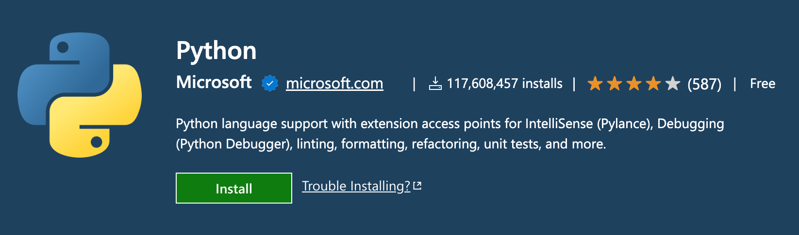
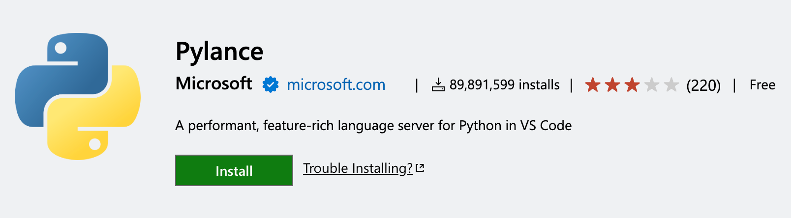
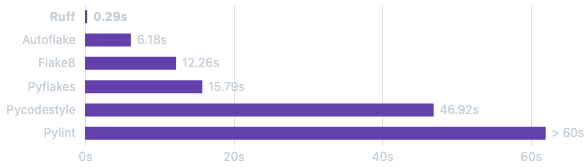
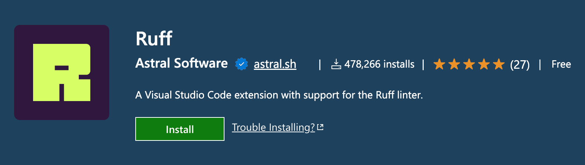
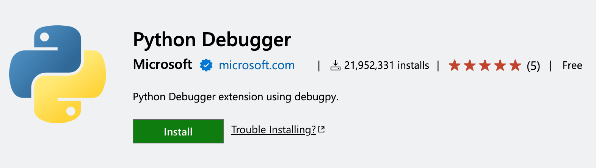
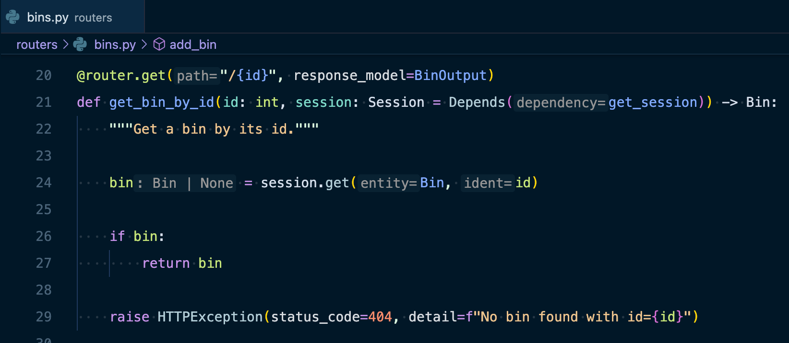
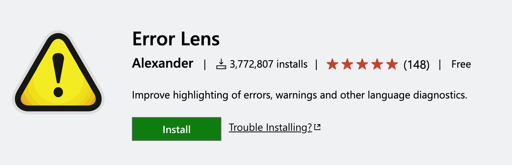
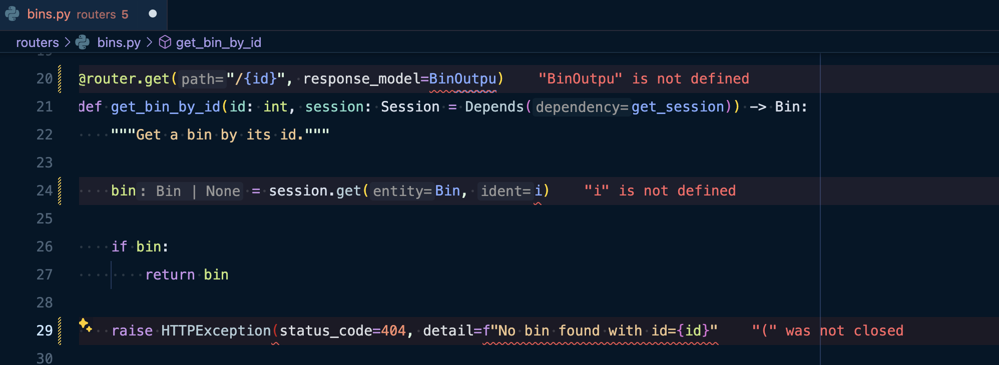

# VSCode extensions and settings + other tools

Tick the checkboxes where you can relate:

- [ ] PyCharm is great but I miss VSCode lightness and customizability. Let's try to configure it.
- [ ] I have just configured VSCode for Python development but intellisense/autocomplete/suggestions are not working as expected.
- [ ] I have watched a lot of YouTube videos and read a lot of articles but it's still not working. I'm missing PyCharm...

If you can relate to any of the above, you are in the right place! I have found a solution that works for me. I hope it works for you too.

> Disclaimer 1: I won't be covering the installation of Python or VSCode. I assume you have them installed 👌

> Disclaimer 2: I have decided to not mention extensions that haven't been updated in over 3 years.

> Disclaimer 3: I am not a professional developer. I am a Product Manager who codes. This guide is a result of my personal experience. It works for me and I hope it works for you too! 🤜🤛 (suggestions are welcome!)

## Python related configuration (essential pack)

### 1 - VSCode editor settings to format on save: 

By default, to open the settings file, press `Ctrl + Shift + P` (or `cmd + Shift + P`) and type `Open User Settings (JSON)`. Then, paste the following settings:

```json
"editor.formatOnSave": true,
"editor.formatOnSaveMode": "file",
"editor.codeActionsOnSave": {
  "source.organizeImports": "explicit"
},
```

(In this guide, I might have not listed some settings that are already well configured by default)

### 2 - Python Official extension ([link](https://marketplace.visualstudio.com/items?itemName=ms-python.python))
[](https://marketplace.visualstudio.com/items?itemName=ms-python.python)

```json
"python.defaultInterpreterPath": "python3",
"python.languageServer": "Pylance", // VERY IMPORTANT! Please recheck this setting after installing Pylance.
"python.analysis.typeCheckingMode": "basic",
"python.analysis.diagnosticMode": "workspace",
"python.analysis.completeFunctionParens": true, // I regret not enabling this setting earlier...
"python.analysis.indexing": true,
"python.analysis.autoImportCompletions": true
```

### 3 - Pylance Official extension ([link](https://marketplace.visualstudio.com/items?itemName=ms-python.vscode-pylance))
Developed by Microsoft, Pylance is a language server for Python that gives me a great experience when developing FastAPI projects in VSCode (I don't know why it only has 3 stars on the marketplace...).

[](https://marketplace.visualstudio.com/items?itemName=ms-python.vscode-pylance)

⚠️ Please, make sure to set the Python language server to Pylance in the Python extension settings and not Jedi! ⚠️ For some reason, mine was set to Jedi by default and messed up the intellisense.

```json
"python.languageServer": "Pylance"
```

### 4 - Ruff: Python linter and formatter written in Rust ([link](https://github.com/astral-sh/ruff))

Benchmark results of Ruff against other Python formatters showed by the author:



I used to utilize `Pylint` alongside `black`, `isort`, and `flake8`, but I've swapped them out for ruff which re-implements the latter three in Rust (check the [FAQ](https://docs.astral.sh/ruff/faq/) for more details).

💯 **Pylance** and **Ruff** are the two main reasons why I don't feel the need go back to PyCharm anymore. The auto-complete and error checking just work perfectly, especially when Python's type hints are used. 💯

I use Ruff's [default configuration](https://docs.astral.sh/ruff/configuration/) and with some other rules:

```toml
# .pyproject.toml

[tool.ruff.lint]
select = ["E4", "E7", "E9", "F", "I001", "S"] # I've added "I001" and "S" to the default rules
```
[I001](https://docs.astral.sh/ruff/rules/unsorted-imports/#unsorted-imports-i001) rule replaces `isort` and [S](https://docs.astral.sh/ruff/rules/#flake8-bandit-s) rules replace [flake8-bandit](https://pypi.org/project/flake8-bandit/) package.

> I use [Pipenv](https://github.com/pypa/pipenv) almost for all my projects, I add Ruff in my Pipfile as a dev dependency. It should be the same with [Poetry](https://github.com/python-poetry/poetry).

### 5 - Ruff Official extension ([link](https://marketplace.visualstudio.com/items?itemName=charliermarsh.ruff))

This extension is a wrapper around the Ruff formatter. It's a must-have if you want to use Ruff in VSCode.

[](https://marketplace.visualstudio.com/items?itemName=charliermarsh.ruff)

Add the path to the Ruff binary in your settings. If you have globally installed Ruff via Homebrew, you would need to add the following settings:

```json
"ruff.path": [
  "/opt/homebrew/bin/ruff"
],
```

### 6 - Python Debugger Official extension ([link](https://marketplace.visualstudio.com/items?itemName=ms-python.python))

If you don't know what's a debugger, you should definitely check it out!

[](https://marketplace.visualstudio.com/items?itemName=ms-python.python)

## Bonuses that makes your life even better

### 7 - Enabling inlay hints (Pylance extension)



If you miss PyCharm's inlay hints, you can enable them in VSCode with Pylance extension by adding the following settings:

```json
"python.analysis.inlayHints.callArgumentNames": "all",
"python.analysis.inlayHints.functionReturnTypes": true,
"python.analysis.inlayHints.pytestParameters": true,
"python.analysis.inlayHints.variableTypes": true,
```

### 8 - Error Lens extension ([link](https://marketplace.visualstudio.com/items?itemName=usernamehw.errorlens))

Inspired by Atom (rip), Error Lens is a great extension that highlights errors and warnings inline in your code. If VSCode error squiggles are not enough for you, you should definitely give it a look.

[](https://marketplace.visualstudio.com/items?itemName=usernamehw.errorlens)

[](https://marketplace.visualstudio.com/items?itemName=usernamehw.errorlens)

I only use default settings for this extension.
